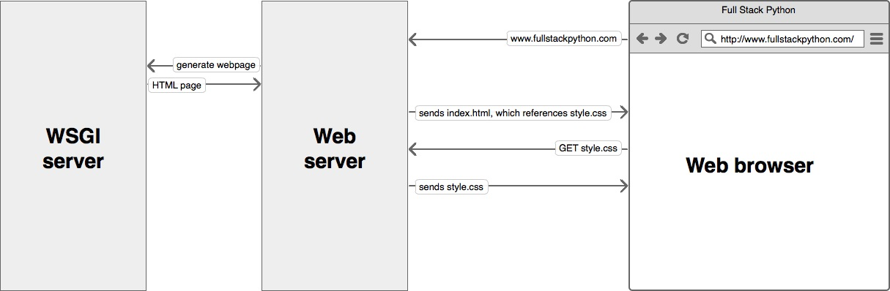

### ITSE-1402 Intermediate Python
<span style="font-family:Helvetica Neue; font-weight:bold; color:#e49436">Class 12: Django, Falcon, and Flask! Oh my! - An Overview of Full Stack</span>
<br /><br />
##### [https://z3r0.tech/slides-12](https://z3r0.tech/slides-12)

-----

## Django, Falcon, and Flask! Oh my! - An Overview of Full Stack
<br /><br /><br /><br /><br />
###### Content in part from https://www.fullstackpython.com. A great resource for information on web frameworks.

+++++

### What is a web framework?

A web framework is a library that makes building reliable, scalable and maintainable web applications relatively easy.

+++++

### Why are web frameworks useful?

Web frameworks allow you to reuse code for common website operations. They also establish a site structure that allows any developer with knowledge of the framework to easily work on it.

+++++

### Common Web Framework Functionality

- Output templating
- URL Routing
- Login / Session tracking and management
- Database manipulation

+++++

Not all web frameworks have all or the same functionality. When evaluating different options, you will see that most are built for a specific kind of site.

Note:
A couple practical examples of this being that Django being "batteries-included" and containing just about everything you would need vs Falcon that is literally written for RESTful APIs.

+++++

Building on this, if you want to look at some specific differences, Django includes an Object-Relational Mapping layer making it so that you don't have to learn SQL to work with relational databases. This also means that you can pretty easily switch between databases as well. This does not translate well though to non-relational databases.

Frameworks like Flask and Falcon don't necessarily have a built-in ORM like Django. They can however use external modules that make working with both relational databases as well as non-relation databases relatively easy. 

+++++

### Django

Django is a widely-used Python web application framework with a "batteries-included" philosophy. The principle behind batteries-included is that the common functionality for building web applications should come with the framework instead of as separate libraries.

+++++

Just a few built in features:

- Authentication
- Url Routing
- Template Engine
- Database Schema Migrations

Note:
Compare this to flask which requires an external library for authentication. The batteries-included and extensibility philosophies are simply two different ways to tackle framework building. Neither philosophy is inherently better than the other one.

+++++

#### Why Django?

The Django project's stability, performance and community have grown tremendously over the past decade since the framework's creation. Detailed tutorials and good practices are readily available on the web and in books. The framework continues to add significant new functionality such as database migrations with each release.

+++++

#### Why Django (cont)

The Django framework is a great starting place for new Python web developers because the official documentation and tutorials are some of the best anywhere in software development. Many cities also have Django-specific groups. While Austin does not currently have one, we do have a “Austin Web Python” meetup that is active. 

+++++

#### Why not Django?

Django is a lot of overhead and you will find that a lot of the “batteries” included are not needed. 

There is a lot of crazy configuration that feels like it is it’s own language in and of itself!

There is debate as to whether or not Django is beneficial to learn for novice python programmers. You will find that there is a lot to the syntax for it that isn’t “pythonic” and doesn’t necessarily make sense without really digging in. 

+++++

#### Flask

Flask is considered more Pythonic than Django because Flask web application code is in most cases more explicit. Flask is easy to get started with as a beginner because there is little boilerplate code for getting a simple app up and running.

Note:
Unlike Django, there isn't too much in the way of features to talk about and we can show the code for a simple hello world in two files.

+++++

Here's a valid "hello world" web application with Flask (the equivalent in Django would be significantly more code):

```python
from flask import Flask
app = Flask(__name__)

@app.route('/')
def hello_world():
    return 'Hello World!'

if __name__ == '__main__':
    app.run()
```

Note:
Flask was also written several years after Django and therefore learned from the Python community's reactions as the framework evolved.

+++++

#### Falcon

Falcon, of the three frameworks we will talk about, is probably the simplest and only for certain use cases. It is a WSGI-compliant web framework designed to build RESTful APIs without requiring external code library dependencies. It is very quick and very minimal.

+++++

app.py

```python
import falcon
import hello_world

api = application = falcon.API()
api.add_route('/', hello_world)
```

hello_world.py

```python
import falcon

class Resource(object):
      def on_get(self, req, resp):
         resp.body = '{"message": "Hello world!"}'
         resp.status = falcon.HTTP_200
```

+++++

#### Is that it?

Of course not. A traditional web server does not understand or have any way to run Python applications. So that means we have to find a way to run it. This is where WSGI comes in.

+++++

#### WSGI

A Web Server Gateway Interface (WSGI) server implements the web server side of the WSGI interface for running Python web applications.

+++++

In the late 1990s, a developer named Grisha Trubetskoy came up with an Apache module called mod\_python to execute arbitrary Python code. For several years in the late 1990s and early 2000s, Apache configured with mod\_python ran most Python web applications.  However, mod\_python wasn't a standard specification. It was just an implementation that allowed Python code to run on a server. 

+++++

As mod\_python's development stalled and security vulnerabilities were discovered there was a need discovered for something better. Therefore the Python community came up with WSGI as a standard interface that modules and containers could implement. WSGI is now the accepted approach for running Python web applications.

+++++



Note:
While you can start a web server with WSGI, it should only be used in development. WSGI does not completely replace a web server. It shares the responsibility with a reverse proxy such as nginx. 

+++++

Below is an example nginx configuration for a WSGI service:

```
# this specifies that there is a WSGI server running on port 8000
upstream app_server_djangoapp {
    server localhost:8000 fail_timeout=0;
}

# Nginx is set up to run on the standard HTTP port and listen for requests
server {
  listen 80;

  # nginx should serve up static files and never send to the WSGI server
  location /static {
    autoindex on;
    alias /srv/www/assets;
  }

  # requests that do not fall under /static are passed on to the WSGI
  # server that was specified above running on port 8000
  location / {
    proxy_set_header X-Forwarded-For $proxy_add_x_forwarded_for;
    proxy_set_header Host $http_host;
    proxy_redirect off;

    if (!-f $request_filename) {
      proxy_pass http://app_server_djangoapp;
      break;
    }
  }
}
```

+++++

More on Falcon and Flask will be coming up next class. The remainder of the class (and possibly homework) is to be spent doing a short Django lab.